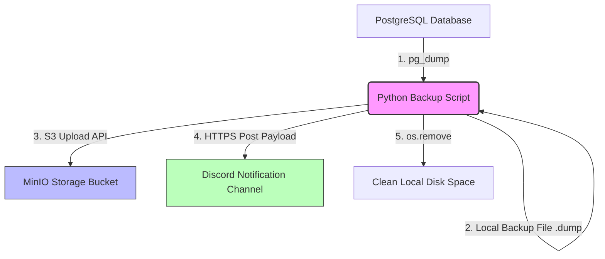
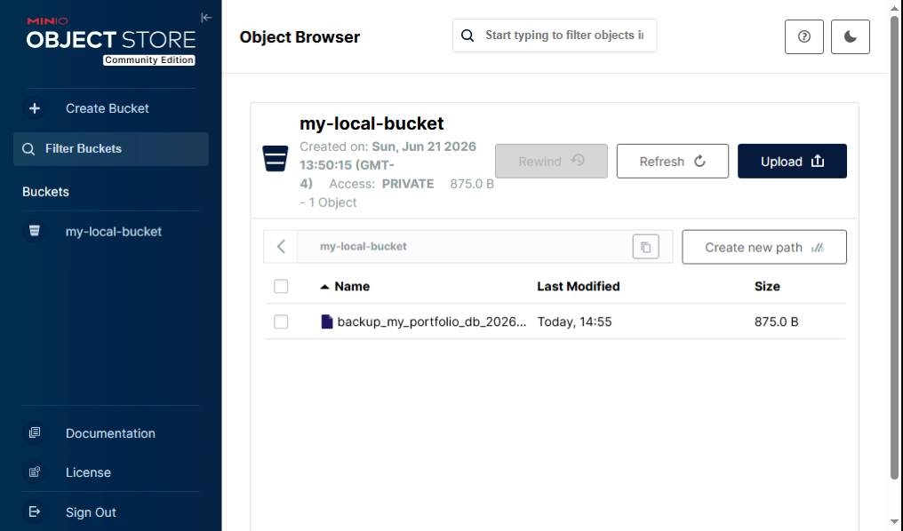
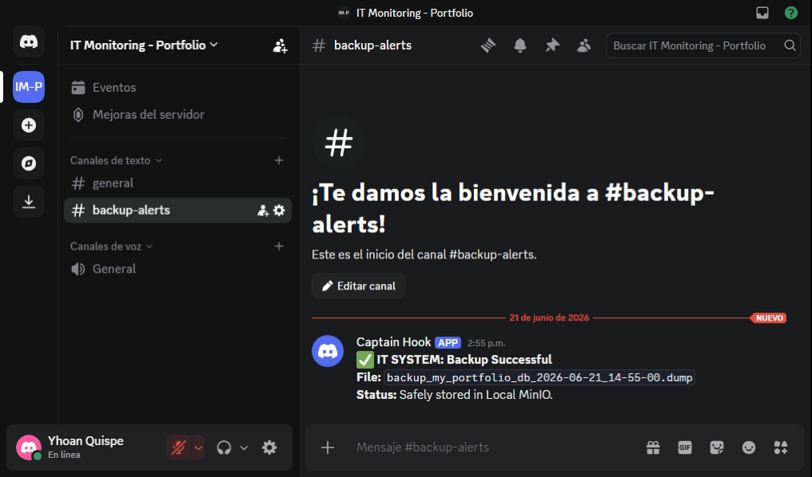

# PostgreSQL Backup Automation to MinIO with Discord Alerts

A production-ready Python automation script designed to extract, compress, and securely upload PostgreSQL database backups to S3-compatible object storage (MinIO), while providing real-time infrastructure monitoring alerts through a Discord webhook interface.

## 🚀 Features

- **Automated Export:** Leverages `pg_dump` to generate native compressed custom-format database backups (`.dump`).
- **S3-Compatible Sync:** Seamlessly streams backup binaries directly into a target **MinIO Object Store** bucket using `boto3`.
- **Infrastructure Monitoring:** Dispatches real-time success or critical failure notification payloads via **Discord Webhooks** to a designated DevOps alert channel.
- **Security First:** Implements zero-hardcoding principles. All sensitive credentials, tokens, and system variables are decoupled and isolated using a `.env` configuration file.
- **Storage Optimization:** Guarantees absolute local disk space clearance by enforcing automated temporary file purging post-upload via a resilient `finally` execution sequence.

## 🛠️ System Architecture Workflow

1. **Trigger:** The script initializes environment configurations and binds active system memory variables.
2. **Backup Execution:** Injects credentials dynamically into the runtime environment to invoke a secure database extraction.
3. **Cloud Transfer:** Establishes a localized S3 API client handshake and multi-part uploads the binary backup payload.
4. **DevOps Notification:** Compiles and posts structured telemetry data directly to the Discord API endpoint.
5. **Disk Purge:** Enforces a hard cleanup routine to completely erase local binary storage remnants.



## 📋 Prerequisites

Ensure the following dependencies are installed and active on your host system:
- **Python 3.x**
- **PostgreSQL CLI tools** (specifically ensuring `pg_dump` is globally exposed to your system path)
- **MinIO Server** (running locally or inside an active instance network)
- **Discord Server Instance** (with Webhook integration permissions active)

## 🔧 Installation & Quick Setup

### 1. Clone the Repository
```bash
git clone [https://github.com/yourusername/postgres-backup-automation.git](https://github.com/yourusername/postgres-backup-automation.git)
cd postgres-backup-automation
```

### 2. Install Dependencies
Initialize and pull the required library ecosystems using `pip`:
```bash
pip install boto3 requests python-dotenv urllib3
```

### 3. Environment Secrets Provisioning
Create a hidden `.env` file within the project workspace root folder:
```bash
touch .env
```
Open the `.env` file and map your sensitive configuration strings explicitly without quotation tokens:
```env
DB_PASSWORD=your_secure_postgres_password_here
DISCORD_WEBHOOK_URL=[https://discord.com/api/webhooks/your_actual_token_here](https://discord.com/api/webhooks/your_actual_token_here)
```

### 4. Script Parameter Audit
Review the target configuration headers inside the script block to verify they match your ongoing local cluster metrics:
```python
DB_NAME = "my_portfolio_db"
DB_USER = "postgres"
DB_HOST = "localhost"

AWS_BUCKET_NAME = "my-local-bucket"
AWS_ACCESS_KEY = "minioadmin"
AWS_SECRET_KEY = "minioadmin"
MINIO_ENDPOINT = "http://localhost:9000"
```

## 💻 Usage & Execution

To manually trigger the backup workflow pipeline, execute:
```bash
python backup.py
```

### Expected Terminal Output Logs
```text
🚀 Starting automation process...
✅ Database exported and compressed successfully.
☁️ Uploading backup to Local MinIO...
🎉 Process completed successfully.
🧹 Local cleanup completed.
```

### 📸 Execution Proof

Key visual confirmations of successful execution pipeline:

| Local MinIO Bucket Storage | Discord DevOps Alerts |
| --- | --- |
|  |  |

## 📂 Repository Tree Structure

```text
postgres-backup-automation/
├── img/
│   ├── captura_minio.png      # Screenshot of the cloud storage bucket
│   └── captura_discord.png    # Screenshot of the Discord notification receipt
├── .env                       # Local credentials and secret webhook tokens (Ignored by Git)
├── .gitignore                 # Explicit rule mappings to prevent secret leaks
├── backup.py                  # Core automated script logic
└── README.md                  # Technical project documentation manual
```

## 🛡️ Security Auditing Policy

This repository includes a strict `.gitignore` configuration profile designed explicitly to block local `.env` data matrixes and `.dump` binaries from hitting remote public tracking channels. **Never force-commit active production environments to an open network visibility tier.**

## 📄 License
This deployment project architecture is open-source software licensed under the standard MIT License schema.