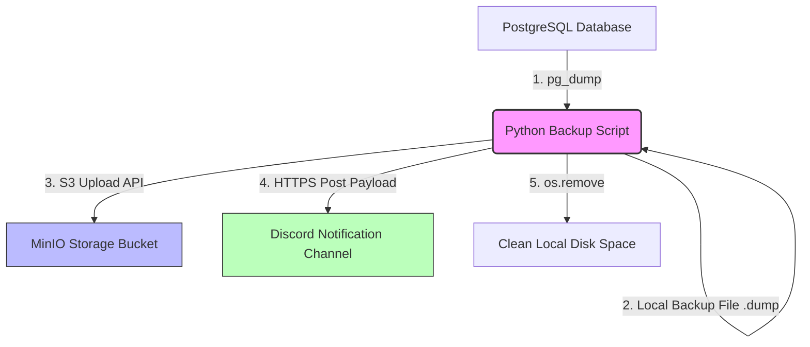

# PostgreSQL Backup Automation to MinIO with Discord Alerts
[](https://github.com/YhoanQuispe/postgres-backup-automation/actions)

A production-ready Python automation script designed to extract, compress, and securely upload PostgreSQL database backups to S3-compatible object storage (MinIO), while providing real-time infrastructure monitoring alerts through a Discord webhook interface.

## 📖 Detailed Overview & Business Value

In production environments, database backups are critical, but managing them manually introduces human error, security risks, and potential data loss. This repository features a fully automated, production-ready DevOps utility written in Python that orchestrates a secure, end-to-end database lifecycle backup strategy.

The solution addresses three core challenges in modern infrastructure management:

* **Secure Data Extraction:** Instead of risking raw SQL exposures, it leverages native PostgreSQL utilities (`pg_dump`) to generate highly compressed, custom-format binaries (`.dump`). This minimizes bandwidth usage and prevents database performance degradation during the backup window.
* **Decoupled & Compliant Storage:** By utilizing the S3 API via `boto3` to communicate with MinIO, the script mirrors cloud-native best practices. It ensures that infrastructure backups are isolated from the application host, adhering to standard disaster recovery guidelines.
* **Proactive Infrastructure Monitoring:** Automated processes shouldn't be a "black box". The integration of real-time monitoring through Discord Webhooks ensures that system administrators and DevOps teams receive immediate feedback—whether a lifecycle event completes successfully or requires immediate troubleshooting due to network anomalies.

### 🧠 Engineering Best Practices Implemented

* **Strict Security Isolation:** Decouples environment configurations from the core logic by using `.env` variable matrices. Credentials never touch the source control visibility layer.
* **Resilient Exception Handling:** Built with defensive programming principles. The script intercepts standard I/O failures, network timeouts, and authentication errors, formatting them into clear telemetry payloads.
* **Zero-Disk-Leak Lifecycle:** Enforces a rigid execution block that guarantees the purge of temporary binary outputs immediately after the network transfer stage, shielding the host machine from storage depletion.

## 🛠️ System Architecture Workflow

1. **Trigger:** The script initializes environment configurations and binds active system memory variables.
2. **Backup Execution:** Injects credentials dynamically into the runtime environment to invoke a secure database extraction.
3. **Cloud Transfer:** Establishes a localized S3 API client handshake and multi-part uploads the binary backup payload.
4. **DevOps Notification:** Compiles and posts structured telemetry data directly to the Discord API endpoint.
5. **Disk Purge:** Enforces a hard cleanup routine to completely erase local binary storage remnants.



## 📋 Prerequisites

Ensure the following dependencies are installed and active on your host system:
- **Python 3.x**
- **PostgreSQL CLI tools** (specifically ensuring `pg_dump` is globally exposed to your system path)
- **MinIO Server** (running locally or inside an active instance network)
- **Discord Server Instance** (with Webhook integration permissions active)

## 🔧 Installation & Quick Setup

### 1. Clone the Repository
```bash
git clone [https://github.com/yourusername/postgres-backup-automation.git](https://github.com/yourusername/postgres-backup-automation.git)
cd postgres-backup-automation
```

### 2. Install Dependencies
Initialize and pull the required library ecosystems using `pip`:
```bash
pip install -r requirements.txt
```

### 3. Environment Secrets Provisioning
Create a hidden `.env` file within the project workspace root folder:
```bash
touch .env
```
Open the `.env` file and map your sensitive configuration strings explicitly without quotation tokens (reference the `.env.example` file for structure):
```env
DB_PASSWORD=your_secure_postgres_password_here
DISCORD_WEBHOOK_URL=[https://discord.com/api/webhooks/your_actual_token_here](https://discord.com/api/webhooks/your_actual_token_here)
```

### 4. Script Parameter Audit
Review the target configuration headers inside the `src/backup.py` script block to verify they match your ongoing local cluster metrics:
```python
DB_NAME = "my_portfolio_db"
DB_USER = "postgres"
DB_HOST = "localhost"

AWS_BUCKET_NAME = "my-local-bucket"
AWS_ACCESS_KEY = "minioadmin"
AWS_SECRET_KEY = "minioadmin"
MINIO_ENDPOINT = "http://localhost:9000"
```

## 💻 Usage & Execution

To manually trigger the backup workflow pipeline, execute the script located inside the source folder:
```bash
python src/backup.py
```

### Expected Terminal Output Logs
```text
🚀 Starting automation process...
✅ Database exported and compressed successfully.
☁️ Uploading backup to Local MinIO...
🎉 Process completed successfully.
🧹 Local cleanup completed.
```

### 📸 Execution Proof

Key visual confirmations of successful execution pipeline:

| Local MinIO Bucket Storage | Discord DevOps Alerts |
| --- | --- |
|  |  |

## 📂 Repository Tree Structure

```text
postgres-backup-automation/
├── img/
│   ├── captura_minio.png      # Screenshot of the cloud storage bucket
│   └── captura_discord.png    # Screenshot of the Discord notification receipt
├── src/
│   └── backup.py              # Core automated script logic
├── .env.example               # Template for environment configuration variables
├── .gitignore                 # Explicit rule mappings to prevent secret leaks
├── README.md                  # Technical project documentation manual
└── requirements.txt           # File containing required Python dependencies
```

## 🛡️ Security Auditing Policy

This repository includes a strict `.gitignore` configuration profile designed explicitly to block local `.env` data matrixes and `.dump` binaries from hitting remote public tracking channels. **Never force-commit active production environments to an open network visibility tier.**

## 📄 License
This deployment project architecture is open-source software licensed under the standard MIT License schema.
